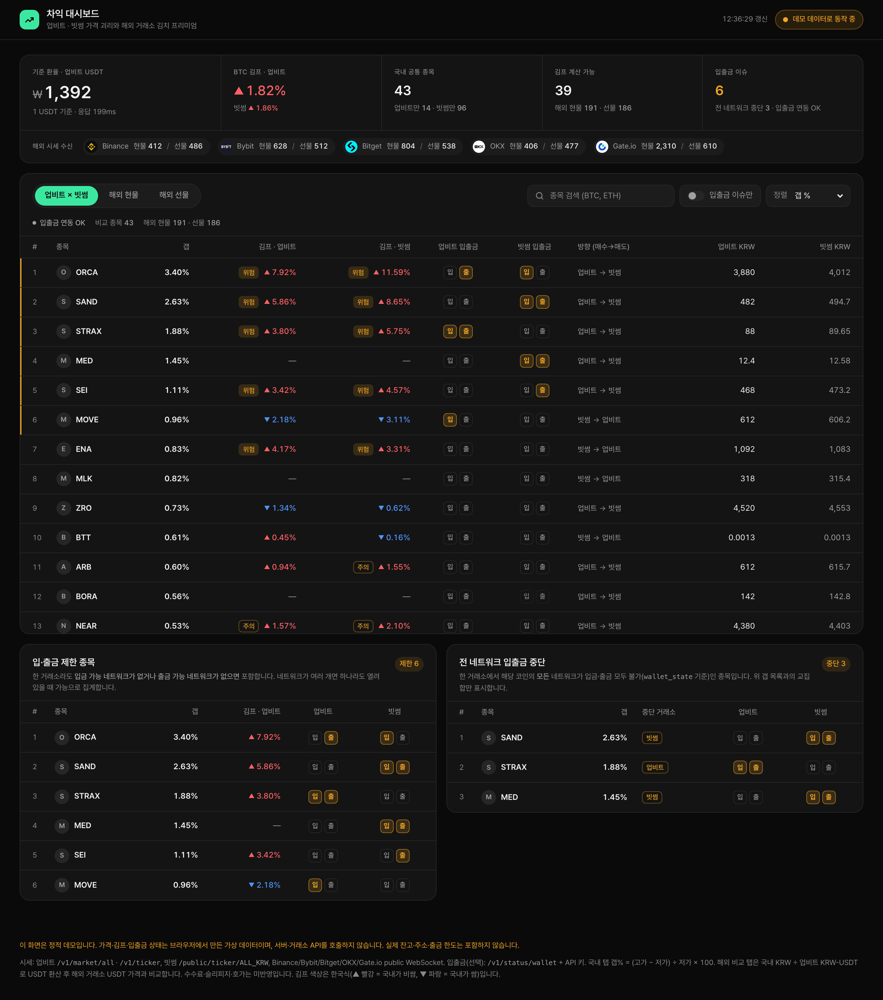
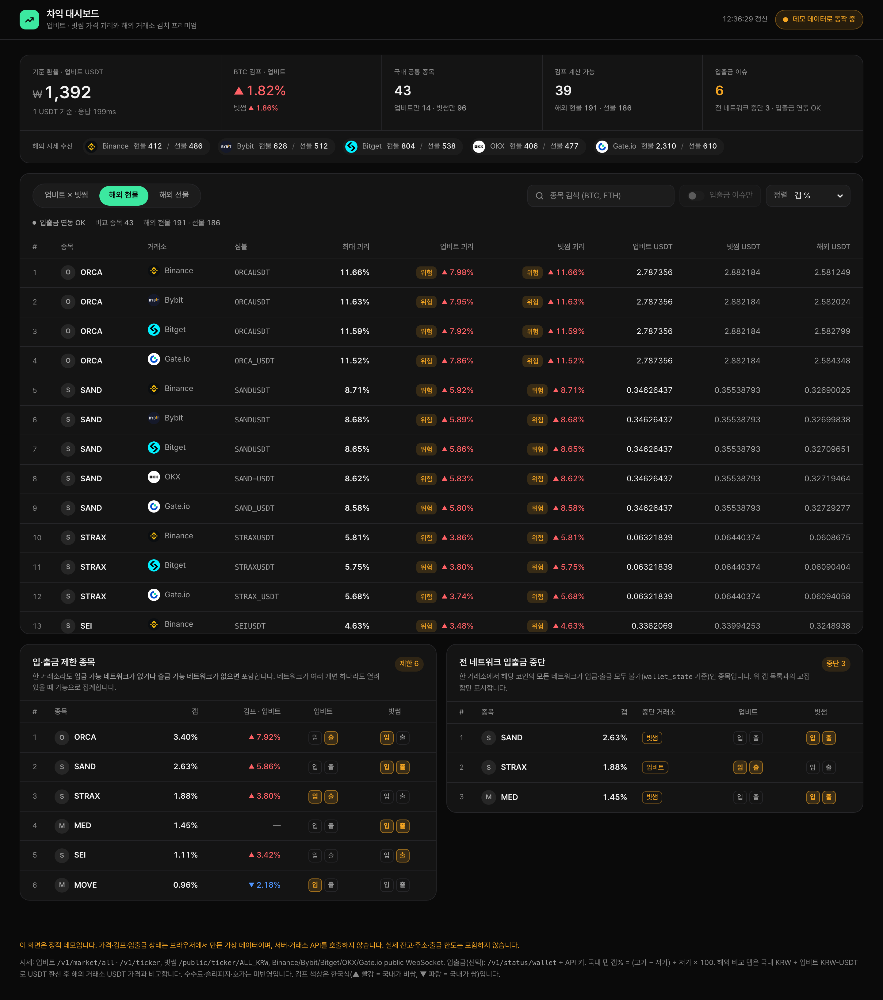
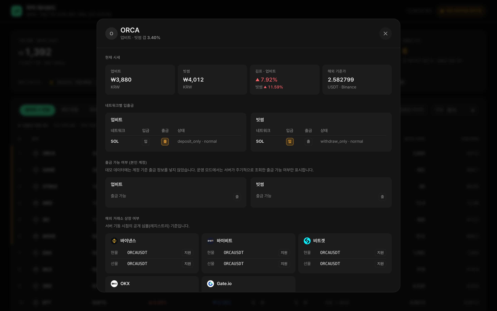
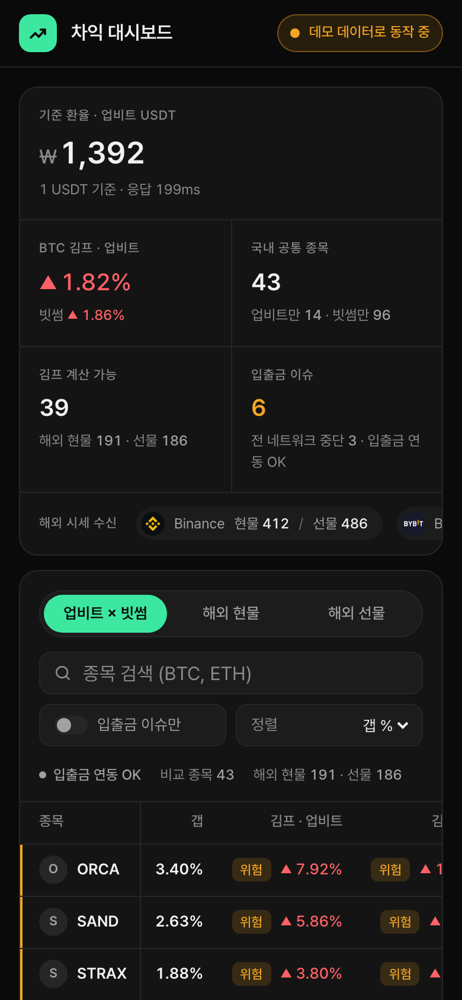
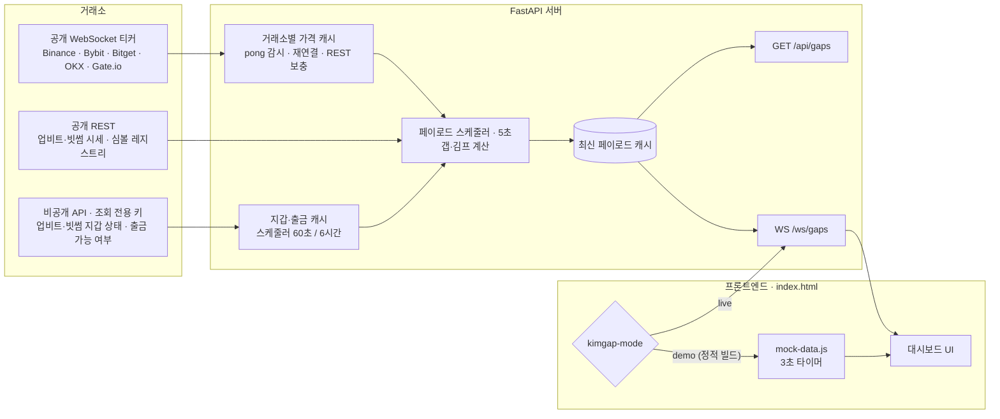

# 차익 대시보드 (kimgap)

업비트·빗썸 가격 괴리와, 해외 거래소 5곳(Binance · Bybit · Bitget · OKX · Gate.io)의 현물·USDT 무기한 선물 대비 **김치 프리미엄을 실시간으로 보여주는 대시보드**입니다.

**라이브 데모: <https://kimgap.com>**
정적 데모 빌드로 운영됩니다. 가격·김프·입출금 상태는 **브라우저에서 만든 가상 데이터**이고(실시세 아님), 서버나 거래소 API를 호출하지 않습니다.



## 주요 기능과 화면

- **국내 갭**: 업비트와 빗썸의 같은 코인 가격 차이(%)와, 싼 쪽에서 비싼 쪽으로의 매수→매도 방향
- **해외 김프**: 국내 KRW 가격을 업비트 USDT 환율로 환산해 해외 5개 거래소의 현물·무기한 가격과 비교. 한국식 색(▲ 빨강 = 국내가 비쌈, ▼ 파랑 = 국내가 쌈)과 부호를 함께 표시
- **입출금 상태**: 네트워크별 입금·출금 가능 여부를 모아, 이슈 종목을 따로 보여줌
- **코인 상세**: 현재 시세, 네트워크별 입출금, 출금 가능 여부, 해외 거래소 상장 심볼
- **반응형**: 모바일에서는 종목 열을 고정한 가로 스크롤 표와 바텀시트 모달로 전환

| 해외 현물 비교 | 코인 상세 | 모바일 |
|---|---|---|
|  |  |  |

스크린샷은 모두 데모 빌드(가상 데이터)로 찍었습니다.

## 아키텍처



- **거래소 호출은 서버 안의 스케줄러만** 합니다. 사용자 요청(`/api/gaps`, `/ws/gaps`)은 최신 페이로드 캐시만 읽습니다.
- 프론트엔드는 `<meta name="kimgap-mode">` 값 하나로 운영(`live`)과 정적 데모(`demo`)를 나눕니다. 데모 빌드는 서버 없이 `mock-data.js`만 씁니다.

## 기술적 결정

**1. 캐시로 호출 증폭 차단**
- 문제: 처음에는 요청이 올 때마다 거래소 API를 호출했습니다. 그래서 WebSocket 연결 수만큼 소유자 키로 비공개 API 호출이 늘어났습니다.
- 결정: 공개 시세(5초), 지갑 상태(60초), 출금 가능 정보(6시간)를 스케줄러로 분리하고, 엔드포인트는 캐시만 반환하게 했습니다.
- 결과: 요청 수와 거래소 호출 수가 무관합니다. 페이로드 계산이 실패하면 마지막 성공값을 유지합니다. 큰 응답은 gzip으로 압축합니다(약 2.4MB → 0.3MB).

**2. 정적 데모와 CSP**
- `scripts/build_demo.py`(표준 라이브러리만 사용) 한 번으로 `dist/`가 만들어집니다. 데모는 모드 값만 `demo`로 바꾼 같은 `index.html`입니다.
- 인라인 스크립트와 스타일은 SHA-256 해시로만 허용합니다(`default-src 'none'`, `connect-src 'self'`, `'unsafe-inline'` 없음). 같은 정책을 `_headers`(Netlify·Cloudflare Pages)와 `<meta>`에 함께 넣습니다.
- 해시할 수 없는 인라인 코드(속성이 붙은 `<script>`, `on*=`, `style=`)가 생기면 빌드가 실패합니다.
- 검증: Playwright로 30초 동안 열어 두고 확인했을 때, **다른 출처 요청·WebSocket·CSP 위반 모두 0건**이었습니다.

**3. WebSocket pong 감시와 재연결**
- OKX는 30초 동안 메시지가 없으면 연결을 끊고, 문자열 `ping`/`pong`으로 연결을 유지합니다.
- 20초 동안 수신이 없으면 `ping`을 보내고, 그 뒤 20초 안에도 응답이 없으면 반쯤 끊긴 연결로 보고 재연결합니다. 멈춘 가격을 실시간 값처럼 보여주지 않기 위해서입니다.
- 로컬 가짜 서버로 두 경우를 확인했습니다. 응답하지 않는 서버에서는 재연결했고, 정상 서버에서는 재연결하지 않았습니다.
- 서버 쪽 `/ws/gaps`도 수신 태스크로 끊김을 감지해 연결 슬롯을 바로 반납합니다.

**4. 폰트 subset**
- 한글 폰트를 CDN에서 받으면 데모의 "외부 요청 0건"을 지킬 수 없습니다.
- Pretendard(SIL OFL 1.1)에서 저장소 문구가 실제로 쓰는 글자(약 500자)만 남겨, 약 3MB를 약 110KB로 줄였습니다.
- OFL의 예약 폰트 이름 조항을 지키려고 폰트 이름은 **Kimgap Sans**로 바꿨습니다. 재생성 스크립트는 `scripts/subset_font.py`입니다.

## 보안 설계

- **조회 전용 키**: 서버는 업비트·빗썸의 `GET /v1/status/wallet`, `GET /v1/withdraws/chance`만 호출합니다. 주문·출금 코드는 없습니다. 운영 키는 조회 권한과 서버 IP로만 제한하도록 안내합니다.
- **관리자 경로 조건부 등록**: `POST /api/refresh-limits`와 `GET /api/limits-status`는 `ADMIN_TOKEN`이 있을 때만 라우트에 등록됩니다. 없으면 어떤 메서드로도 404라 경로가 있는지조차 드러나지 않습니다. 등록된 경우에도 `X-Admin-Token` 헤더를 상수 시간으로 비교하고, 갱신에는 쿨다운을 둡니다.
- **출금 금액 비공개**: 출금 정보는 `can_withdraw` 불리언만 수집·공개합니다. 한도·잔여·최소 금액은 서버에 저장하지도 않습니다. 거래소 오류 원문 대신 `auth_error` 같은 짧은 코드만 내보냅니다.
- **속도 제한과 연결 상한**: IP별 토큰 버킷으로 HTTP 요청과 WebSocket 연결 시도를 제한하고, WebSocket 동시 연결은 전체와 IP별로 제한합니다. API 문서(`/docs` 등)는 기본으로 꺼져 있고, CORS는 설정한 출처에 GET만 허용합니다.
- **테스트 30개** (`tests/`, pytest): 항목별로 검증합니다. 테스트는 `.env`를 읽지 않고, 외부로 나가는 네트워크 호출을 모두 차단한 상태로 실행합니다. 보안 강화 전 코드에 돌리면 대부분 실패하는 것도 확인했습니다(당시 26개 중 23개 실패).

---

## 실행하기

### 정적 데모 (백엔드 없이)

```bash
python3 scripts/build_demo.py                                   # dist/ 생성
python3 -m http.server 8080 --bind 127.0.0.1 --directory dist   # http://127.0.0.1:8080/
```

- `dist/`는 정적 호스팅에 폴더째 올리면 됩니다(git에서는 제외).
- 데모 데이터에는 실제 잔고, 지갑 주소, 출금 한도 금액이 없습니다.
- 로컬 `http.server`는 `_headers`를 적용하지 않지만, `<meta>` CSP는 적용됩니다.

### 실데이터 모드

```bash
pip install -r requirements.txt
cp .env.example .env        # 거래소 API 키(선택)를 채운다
uvicorn gap_dashboard.main:app --host 127.0.0.1 --port 8000
```

- 브라우저에서는 `http://127.0.0.1:8000/`(루트)로 엽니다. 자산 경로가 상대 경로라 `/static/index.html`로 열면 폰트와 로고가 404가 됩니다.
- 해외 5개 거래소는 모두 **공개 API만** 씁니다. 기동할 때 REST로 USDT 현물·무기한 심볼 목록을 받고, 티커 WebSocket으로 가격을 유지하며, 부족하면 REST 티커로 채웁니다.
- API 키가 없어도 시세와 김프는 동작합니다. 키가 있으면 네트워크별 입출금 상태와 코인별 출금 가능 여부를 함께 보여줍니다.

### 실행 모드

| 모드 | 설정 | 동작 |
|---|---|---|
| 운영 (`live`) | `<meta name="kimgap-mode" content="live">` (소스 기본값) | 서버 `WebSocket /ws/gaps`로 실데이터 수신 |
| 데모 (`demo`) | 빌드 스크립트가 `content="demo"`로 바꿈 | `static/mock-data.js` 가상 데이터만 사용, 네트워크 호출 없음 |
| 운영 페이지 목업 확인 | 운영 URL에 `?mock=1` | 데모와 같은 가상 데이터로 렌더링(개발·스크린샷용) |

### 공개 서버 운영

별도 설정이 없어도 기본값이 안전한 쪽입니다. 변수 이름은 `.env.example`에 있습니다.

| 항목 | 적용 내용 | 설정(환경변수, 기본값) |
|---|---|---|
| 거래소 호출과 요청 분리 | 거래소 API는 스케줄러만 호출하고, `/api/gaps`·`/ws/gaps`는 캐시만 반환합니다. 첫 페이로드가 준비되기 전에는 `503`을 돌려줍니다 | `GAP_WS_INTERVAL_SEC`(5초), `WALLET_STATUS_INTERVAL_SEC`(60초, 최소 30), `WITHDRAW_INFO_INTERVAL_SEC`(21600초, 최소 600) |
| 관리자 엔드포인트 | `ADMIN_TOKEN`이 없으면 경로를 등록하지 않아 404입니다. 있으면 `X-Admin-Token`이 필요하고(없으면 401, 틀리면 403), 갱신은 쿨다운을 둡니다(`429` + `Retry-After`). 토큰은 ASCII 문자로 정하세요 | `ADMIN_TOKEN`(비움), `ADMIN_REFRESH_COOLDOWN_SEC`(600초, 최소 60) |
| 출금 정보 공개 범위 | 코인별 `withdraw_status`(`upbit_can_withdraw`, `bithumb_can_withdraw`, 불리언)만 공개하고, 오류는 코드로만 공개합니다 | — |
| API 문서 | `/docs`, `/redoc`, `/openapi.json` 기본 끔 | `ENABLE_API_DOCS=1` |
| CORS | 기본은 CORS 헤더 없음(같은 출처만)입니다. 설정한 출처에만 GET을 허용합니다. 브라우저 WebSocket의 `Origin`도 같은 목록으로 제한하므로 **대시보드 자신의 출처도 목록에 넣어야** 합니다 | `CORS_ALLOW_ORIGINS`(쉼표 구분) |
| 요청 속도 제한 | IP별 분당 한도를 넘으면 `429`와 `Retry-After`를 돌려줍니다. WebSocket 연결 시도도 포함하고, `/static/*`은 제외합니다 | `RATE_LIMIT_PER_MIN`(120) |
| WebSocket 연결 상한 | 전체·IP별 동시 연결 수를 넘으면 거부합니다(연결 수락 전 거부라 HTTP 403으로 보임) | `WS_MAX_CONNECTIONS`(200), `WS_MAX_PER_IP`(5) |
| 응답 압축 | 1KB 이상 HTTP 응답을 gzip으로 보냅니다. WebSocket은 uvicorn의 permessage-deflate가 압축합니다 | — |

- **리버스 프록시 뒤**: 속도 제한은 클라이언트 IP 기준입니다. uvicorn은 기본적으로 `127.0.0.1`에서 온 `X-Forwarded-For`를 신뢰합니다. 프록시가 다른 주소에 있으면 `--forwarded-allow-ips`로 그 주소를 지정하세요.

### 테스트

```bash
pip install -r requirements-dev.txt
python -m pytest
```

## 프로젝트 구조

- `gap_dashboard/main.py`: FastAPI 백엔드(시세 수집, 스케줄러, 김프 계산, `/api/*`, `/ws/gaps`)
- `gap_dashboard/static/index.html`: 프론트엔드(순수 JS, 디자인 토큰 기반)
- `gap_dashboard/static/mock-data.js`: 데모·목업 데이터 생성기
- `gap_dashboard/static/fonts/`: subset 폰트와 라이선스(OFL)
- `scripts/build_demo.py`: 정적 데모 빌드 / `scripts/subset_font.py`: 폰트 subset 생성
- `tests/`: 보안·캐시 동작 테스트
- `docs/screenshots/`: README 스크린샷(데모 데이터)
- `UI_REBUILD_NOTES.md`: UI 리빌드부터 보안 강화까지의 결정 사항과 검증 기록

### `data/*.json` 스냅샷이 필요한가요?

**필요 없습니다.**
- `main.py`는 `data/` 폴더를 읽지도 쓰지도 않습니다.
- 입출금 상태는 지갑 스케줄러가 업비트·빗썸 `/v1/status/wallet`에서 주기적으로 받습니다.
- 해외 심볼 목록은 기동할 때 각 거래소 공개 API에서 받습니다.

초기 커밋에 들어간 `raw_networks_*`, `rpc_mapping_*`, `unique_networks_*` 스냅샷은 참고용이었습니다. 이를 만든 스크립트가 저장소 히스토리에 없어서 재생성 방법은 제공하지 않습니다. 지금은 `.gitignore`로 제외됩니다.

## 라이선스

- 코드: [MIT](LICENSE)
- 폰트 `Kimgap Sans`: Pretendard에서 파생한 subset으로, [SIL Open Font License 1.1](gap_dashboard/static/fonts/OFL.txt)을 따릅니다.
- 거래소 로고: 각 거래소의 상표이며 MIT 라이선스 대상이 아닙니다. 거래소를 식별하는 용도로만 씁니다. 바이낸스 마크는 [Simple Icons](https://simpleicons.org)(CC0) 데이터로 만들었습니다.
